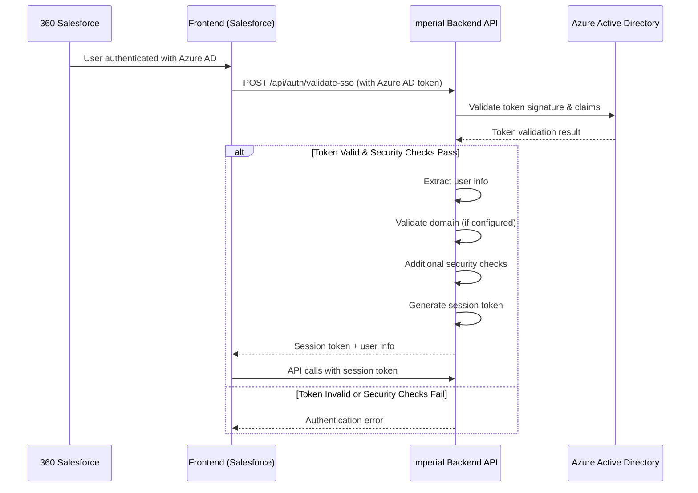

# SSO Integration Guide - Imperial Backend API

## Overview

This document provides comprehensive guidance for integrating the Imperial Backend API with 360 Salesforce using Azure AD Single Sign-On (SSO) with streamlined token validation focusing on core security checks.

## 360 Salesforce SSO Integration - STREAMLINED APPROACH

### Security-First Token Validation Implementation

Our SSO implementation prioritizes security through comprehensive token validation while maintaining simplicity by focusing on core security checks without complex role management.



## API Endpoints for SSO Integration

### 1. Token Validation Endpoint

**POST** `/api/auth/validate-sso`

Validates Azure AD tokens from 360 Salesforce with comprehensive security checks.

**Request:**
```json
{
  "accessToken": "eyJ0eXAiOiJKV1QiLCJhbGciOiJSUzI1NiIs...",
  "source": "salesforce-360"
}
```

**Response (Success):**
```json
{
  "isValid": true,
  "user": {
    "id": "user-object-id",
    "email": "user@company.com",
    "name": "John Doe",
    "givenName": "John",
    "familyName": "Doe",
    "tenantId": "tenant-id"
  },
  "sessionToken": "eyJ0eXAiOiJKV1QiLCJhbGciOiJIUzI1NiIs...",
  "expiresAt": "2024-01-01T16:00:00Z"
}
```

**Response (Error):**
```json
{
  "error": "Token validation failed",
  "code": "TOKEN_VALIDATION_FAILED"
}
```

### 2. Session Management Endpoints

**POST** `/api/auth/refresh-session` - Refresh session token
**GET** `/api/auth/me` - Get current user info
**POST** `/api/auth/logout` - Logout user

### 3. Business API Endpoints

**GET** `/api/outlets` - Get outlets with filtering and pagination
**GET** `/api/outlets/{id}` - Get outlet by ID
**POST** `/api/outlets` - Create new outlet

## Security Features Implemented

### Core Token Validation
- **Cryptographic Signature Validation**: Validates token signature against Azure AD public keys
- **Issuer Validation**: Ensures token is issued by the correct Azure AD tenant
- **Audience Validation**: Verifies token is intended for this application
- **Expiration Validation**: Checks token hasn't expired with clock skew tolerance
- **Algorithm Validation**: Ensures token uses secure RSA SHA-256 algorithm

### Additional Security Checks
- **Domain Validation**: Optional domain restrictions for user emails
- **Tenant Validation**: Ensures users belong to the expected Azure AD tenant
- **Token Age Validation**: Additional check for token freshness beyond expiration
- **Authentication Method Validation**: Optional validation of how user authenticated

### Session Security
- **Application-Specific Tokens**: Issues new JWT tokens for internal API access
- **Session Expiration**: Configurable session timeout (default 8 hours)
- **Unique Session IDs**: Each session gets a unique identifier for tracking

## Configuration Required

### Azure AD Configuration (`appsettings.json`)

```json
{
  "AzureAd": {
    "Instance": "https://login.microsoftonline.com/",
    "Domain": "yourcompany.onmicrosoft.com",
    "TenantId": "your-tenant-id",
    "ClientId": "your-client-id",
    "Audience": "your-audience"
  }
}
```

### JWT Configuration

```json
{
  "JWT": {
    "SecretKey": "your-super-secret-key-that-should-be-at-least-32-characters-long-for-security",
    "Issuer": "ImperialBackend",
    "Audience": "ImperialBackend.Api",
    "ExpirationHours": 8
  }
}
```

### Authorization Configuration (Optional)

```json
{
  "Authorization": {
    "AllowedDomains": [
      "yourcompany.com",
      "yourpartner.com"
    ],
    "SessionTimeout": "08:00:00"
  }
}
```

### Security Configuration

```json
{
  "Security": {
    "MaxTokenAgeMinutes": 60,
    "RequiredAuthMethod": ""
  }
}
```

### Salesforce Integration Configuration

```json
{
  "SalesforceIntegration": {
    "AllowedOrigins": [
      "https://your-salesforce-instance.lightning.force.com",
      "https://your-custom-domain.my.salesforce.com"
    ],
    "TrustedAppIds": [
      "salesforce-360-app-id"
    ]
  }
}
```

## Frontend Integration (360 Salesforce)

### JavaScript Example

```javascript
class ImperialBackendSSO {
    constructor(apiBaseUrl) {
        this.apiBaseUrl = apiBaseUrl;
        this.sessionToken = null;
    }

    async validateSSOToken(azureAdToken) {
        try {
            const response = await fetch(`${this.apiBaseUrl}/api/auth/validate-sso`, {
                method: 'POST',
                headers: {
                    'Content-Type': 'application/json'
                },
                body: JSON.stringify({
                    accessToken: azureAdToken,
                    source: 'salesforce-360'
                })
            });

            const data = await response.json();
            
            if (data.isValid) {
                this.sessionToken = data.sessionToken;
                this.user = data.user;
                this.tokenExpiry = new Date(data.expiresAt);
                return { success: true, user: data.user };
            } else {
                console.error('SSO validation failed:', data.error);
                return { success: false, error: data.error };
            }
        } catch (error) {
            console.error('SSO validation error:', error);
            return { success: false, error: 'Network error' };
        }
    }

    async callAPI(endpoint, options = {}) {
        if (!this.sessionToken) {
            throw new Error('No valid session token');
        }

        // Check if token is about to expire and refresh if needed
        if (this.tokenExpiry && new Date() > new Date(this.tokenExpiry.getTime() - 5 * 60 * 1000)) {
            await this.refreshSession();
        }

        const headers = {
            'Authorization': `Bearer ${this.sessionToken}`,
            'Content-Type': 'application/json',
            ...options.headers
        };

        return fetch(`${this.apiBaseUrl}${endpoint}`, {
            ...options,
            headers
        });
    }

    async getOutletById(outletId) {
        const response = await this.callAPI(`/api/outlets/${outletId}`);
        return response.json();
    }

    async refreshSession() {
        try {
            const response = await fetch(`${this.apiBaseUrl}/api/auth/refresh-session`, {
                method: 'POST',
                headers: {
                    'Authorization': `Bearer ${this.sessionToken}`,
                    'Content-Type': 'application/json'
                }
            });

            const data = await response.json();
            if (data.sessionToken) {
                this.sessionToken = data.sessionToken;
                this.tokenExpiry = new Date(data.expiresAt);
            }
        } catch (error) {
            console.error('Session refresh failed:', error);
            this.sessionToken = null;
        }
    }
}

// Usage in Salesforce
async function initializeImperialBackend() {
    const sso = new ImperialBackendSSO('https://your-api-domain.com');
    
    // Get Azure AD token from Salesforce context
    const azureToken = await getAzureTokenFromSalesforce();
    
    const result = await sso.validateSSOToken(azureToken);
    if (result.success) {
        console.log('User authenticated:', result.user);
        
        // Example: Get outlet data
        const outlet = await sso.getOutletById(123);
        console.log('Outlet data:', outlet);
    } else {
        console.error('Authentication failed:', result.error);
    }
}
```

### Lightning Web Component Example

```javascript
import { LightningElement, track } from 'lwc';
import { getAzureAccessToken } from '@salesforce/apex/AzureAuthController.getAccessToken';

export default class ImperialBackendIntegration extends LightningElement {
    @track user = null;
    @track outlets = [];
    @track error = null;

    apiBaseUrl = 'https://your-api-domain.com';
    sessionToken = null;

    async connectedCallback() {
        await this.initializeSSO();
    }

    async initializeSSO() {
        try {
            // Get Azure AD token from Salesforce
            const azureToken = await getAzureAccessToken();
            
            // Validate with Imperial Backend
            const response = await fetch(`${this.apiBaseUrl}/api/auth/validate-sso`, {
                method: 'POST',
                headers: { 'Content-Type': 'application/json' },
                body: JSON.stringify({
                    accessToken: azureToken,
                    source: 'salesforce-360'
                })
            });

            const data = await response.json();
            
            if (data.isValid) {
                this.user = data.user;
                this.sessionToken = data.sessionToken;
                await this.loadOutlets();
            } else {
                this.error = data.error;
            }
        } catch (error) {
            this.error = error.message;
        }
    }

    async loadOutlets() {
        try {
            const response = await fetch(`${this.apiBaseUrl}/api/outlets`, {
                headers: {
                    'Authorization': `Bearer ${this.sessionToken}`,
                    'Content-Type': 'application/json'
                }
            });

            this.outlets = await response.json();
        } catch (error) {
            this.error = error.message;
        }
    }
}
```

## Security Best Practices Implemented

### Defense in Depth
- **Multiple Validation Layers**: Token format → Signature → Claims → Business rules
- **Fail-Safe Defaults**: Deny access if any validation step fails
- **Comprehensive Logging**: Security events logged for monitoring and audit

### Attack Prevention
- **Token Replay Protection**: Short-lived tokens with unique session IDs
- **Algorithm Confusion**: Strict algorithm validation (RS256 only)
- **Clock Skew Attack**: Limited tolerance for time differences
- **Domain Spoofing**: Optional domain validation for user emails

### Compliance Features
- **Audit Trail**: Comprehensive logging of authentication events
- **Data Protection**: No sensitive data stored; stateless token validation
- **Session Management**: Secure session handling with configurable timeouts

## Monitoring & Analytics

### Security Events Logged
- SSO validation attempts (success/failure)
- Token validation failures with reasons
- Domain validation failures
- Session creation and refresh events
- API access with user context

### Metrics to Monitor
- SSO success/failure rates
- Token validation response times
- Session duration patterns
- API usage by authenticated users
- Security violation attempts

---

## Support & Troubleshooting

### Common Issues

1. **Token Validation Fails**
   - Verify Azure AD configuration (TenantId, ClientId)
   - Check token expiration
   - Validate network connectivity to Azure AD

2. **Domain Validation Issues**
   - Check user email domain against `AllowedDomains` configuration
   - Verify domain configuration is correct

3. **Session Token Issues**
   - Ensure JWT SecretKey is properly configured (32+ characters)
   - Check session expiration settings
   - Verify token is being sent in Authorization header

For additional support, contact the Imperial Backend team at support@imperialbackend.com.